# ⚡ Termination Indicators in Sequence Diagrams

## Overview

When using condition-based termination, sequence diagrams now include an explicit **termination indicator** showing when and why the simulation stopped.

## Visual Example

```mermaid
sequenceDiagram
    philosopher_0->>fork_0: {:start_hungry, :fork_0, :fork_1}
    Note over philosopher_0,fork_0: t=100ms
    philosopher_1->>fork_1: {:start_hungry, :fork_1, :fork_2}
    Note over philosopher_1,fork_1: t=200ms
    philosopher_2->>fork_2: {:start_hungry, :fork_2, :fork_0}
    Note over philosopher_2,fork_2: t=300ms
    Note over philosopher_0,fork_2: ⚡ Terminated at t=600ms (goal achieved)
```



The **⚡ Terminated** note appears at the end of the sequence, showing:
- ⏱️ Exact virtual time when simulation stopped
- 🎯 Reason: "goal achieved" (from termination condition)

## How It Works

### 1. Enable Condition-Based Termination

```elixir
simulation = 
  DiningPhilosophers.create_simulation(num_philosophers: 3)
  |> ActorSimulation.run(
      max_duration: 10_000,
      terminate_when: fn sim ->
        # Stop when all philosophers have eaten 3 times
        stats = ActorSimulation.collect_current_stats(sim)
        all_fed?(stats)
      end
    )
```

### 2. Generate Diagram with Termination Indicator

```elixir
# Default: termination indicator shown
mermaid = ActorSimulation.trace_to_mermaid(simulation,
  enhanced: true,
  timestamps: true,
  show_termination: true  # Default: true
)

# Without termination indicator
mermaid = ActorSimulation.trace_to_mermaid(simulation,
  show_termination: false
)
```

### 3. Visual Result

The diagram will include at the end:
```
Note over actor1,actor2: ⚡ Terminated at t=1234ms (goal achieved)
```

## Implementation Details

### Automatic Detection

The system automatically:
1. Detects if `terminate_when` was used
2. Checks if `actual_duration < max_duration`
3. Sets `simulation.terminated_early = true`
4. Includes termination note in diagram

### Note Placement

The termination note appears:
- **Over two actors**: If 2+ actors in trace
- **Over one actor**: If only 1 actor in trace
- **At the bottom**: After all other events

### Customization

```elixir
# Show termination with timestamps
trace_to_mermaid(sim, show_termination: true, timestamps: true)

# Hide termination indicator
trace_to_mermaid(sim, show_termination: false)

# Access termination info programmatically
if simulation.terminated_early do
  IO.puts("Stopped early at #{simulation.actual_duration}ms")
end
```

## Use Cases

### 1. Dining Philosophers
Shows when all philosophers have been fed:
```
⚡ Terminated at t=600ms (goal achieved)
```

### 2. Message Processing
Shows when message quota reached:
```
⚡ Terminated at t=2500ms (goal achieved)
```

### 3. Convergence Detection
Shows when system stabilized:
```
⚡ Terminated at t=1234ms (goal achieved)
```

## Generated Files

View these examples:
- `test/output/dining_philosophers_condition_terminated.html` - Shows termination
- Other dining philosopher diagrams - Run full duration (no indicator)

## API Impact

### New Fields (All Optional, Backward Compatible)
- `simulation.actual_duration` - How long simulation ran
- `simulation.terminated_early` - Boolean flag
- `simulation.termination_reason` - Reserved for future use

### New Options (All Optional)
- `show_termination: true/false` in `trace_to_mermaid/2`

### New Functions (All Additive)
- `collect_current_stats/1` - Get stats during simulation

## Benefits

1. **Visual Feedback** - See exactly when simulation stopped
2. **Goal Achievement** - Clear indicator that condition was met
3. **Debugging Aid** - Understand simulation behavior
4. **Documentation** - Diagrams are self-explanatory
5. **No Breaking Changes** - Fully backward compatible

## Example Output

Open `test/output/dining_philosophers_condition_terminated.html` to see:

```
✅ Termination Condition Met!
Simulation stopped at 600ms when all philosophers had eaten enough.
Look for the ⚡ Terminated note at the bottom of the diagram!
```

Then in the sequence diagram, you'll see the explicit termination marker showing exactly when the goal was achieved.

---

**This feature makes condition-based termination visual and self-documenting!**

